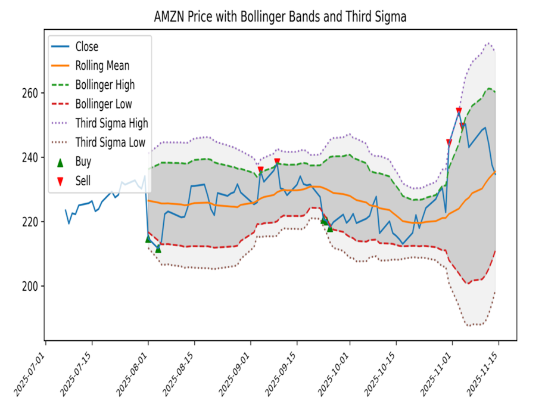
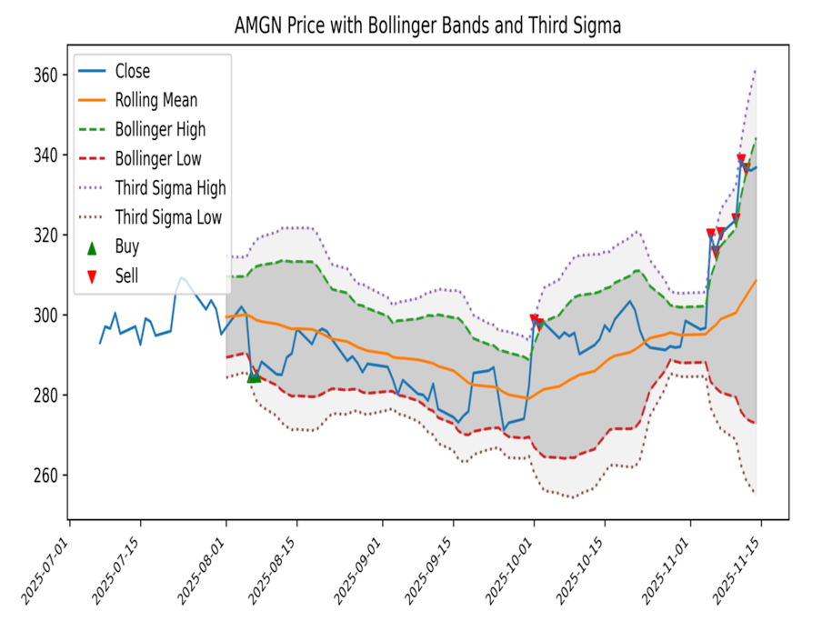

# pythia

A Python-based stock price slideshow application that retrieves historical data, computes Bollinger Bands and third-sigma ranges, generates charts, and displays them using a Tkinter slideshow interface.

This program uses Tkinter for the graphical user interface (GUI) and the Yahoo Finance API (`yfinance`) for data acquisition. For each predefined ticker, it downloads historical price data, computes technical indicators, renders annotated charts, and stores them as images. The resulting charts can be navigated manually or viewed through an automated slideshow.

The application includes forward/back navigation, a play/pause toggle, and status feedback during data generation. It ensures that cached charts are refreshed when out of date.

This program is unfinished and performs technical analysis on historical data only. The **Buy** and **Sell** markers are demonstrative overlays applied to historical prices; they do not provide trading signals. This software is for educational purposes only; though if you manage to turn it into a fortune, feel free to buy me a Winnebago.

## Prerequisites

Ensure the following components are installed:

- Python 3.x **with Tcl/Tk support** (required for Tkinter)
- `pandas`
- `yfinance`
- `matplotlib`
- `Pillow`

Install Python dependencies with:

```bash
pip install pandas yfinance matplotlib Pillow
```

If using macOS with Homebrew, ensure Tk is installed first:

```bash
brew install tcl-tk
```

Then install Python with Tk support:

```bash
brew install python-tk@3.14
```

## Features

- Automated retrieval of historical price data.
- Computation of Bollinger Bands and third-sigma envelopes.
- Chart generation and caching to avoid redundant downloads.
- Tkinter-based slideshow with manual and automatic navigation.
- Keyboard shortcut (`q`) to quit.
- Simple progress indicator during data preparation.

## Demo

An arbitrary ticker plot from the slideshow (AMZN):



Another arbitrary ticker plot from the slideshow (AMGN):



## Usage

1. Clone this repository or download the source code.
2. Open a terminal and navigate to the directory.
3. Run the program:

```bash
python pythia.py
```

The program will create a directory named `graphs` to store generated chart images.

During execution:

```
Press q to quit.
```

## Configuration

Modify the ticker list in the `main()` function of `pythia.py` to customize which symbols appear in the slideshow.

## Contribution

Contributions to this project are welcome. If you find issues or have suggestions for improvements or new features, submit a pull request or open an issue.

## License

This project is licensed under the MIT License. See the [LICENSE](LICENSE) file for details.


## Acknowledgments

The development of the first version of this application benefited from the assistance of language models, including GPT-3.5 and GPT-4, provided by OpenAI. The author acknowledges the valuable contributions made by these language models in generating design ideas and providing insights during the development process.
